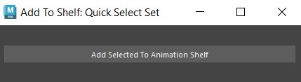

# Maya Plugin

This is a single maya plug in to make animationg and navigating sub menues easier!
#How to Install:
drag the install.mel file into maya's viewport, and the tool will apear on the current shelf 
note: you should probably drag this into the animation shelf

## Quick Select Set Shelf Button

* Creates a window
* Clicking the button creates a set in the outliner and adds the set to the Animation shelf
* Will recive Error message if nothing is selected when pressing the button
* easy to understand steps and explainations in the script editor